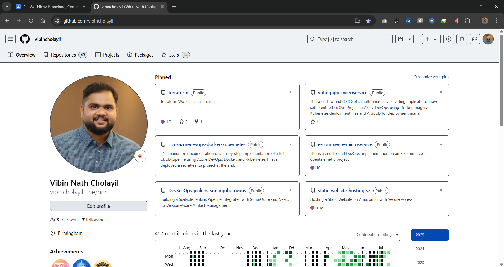

# Git Workflow: Branching, Commits, Squash Merge and Pull Requests

## Objective

The objective of this task is to share hands-on understanding with Git by performing essential version control operations. This includes creating a repository, working with branches, making multiple commits, and using squash merging to maintain a clean commit history. I will also practice pushing changes to a remote repository and documenting your work with proper screenshots.

## Prerequisite

- A GitHub account  
- Ubuntu VM  
- Git installed on the VM  

## Task 1

Create a GitHub repo named **Alpha**

