# Git Workflow: Branching, Commits, Squash Merge and Pull Requests

## Objective

The objective of this task is to share hands-on understanding with Git by performing essential version control operations. This includes creating a repository, working with branches, making multiple commits, and using squash merging to maintain a clean commit history. I will also practice pushing changes to a remote repository and documenting your work with proper screenshots.

## Prerequisite

- A GitHub account  
- Ubuntu VM  
- Git installed on the VM  

## Task 1

Create a GitHub repo named **Alpha**  
  
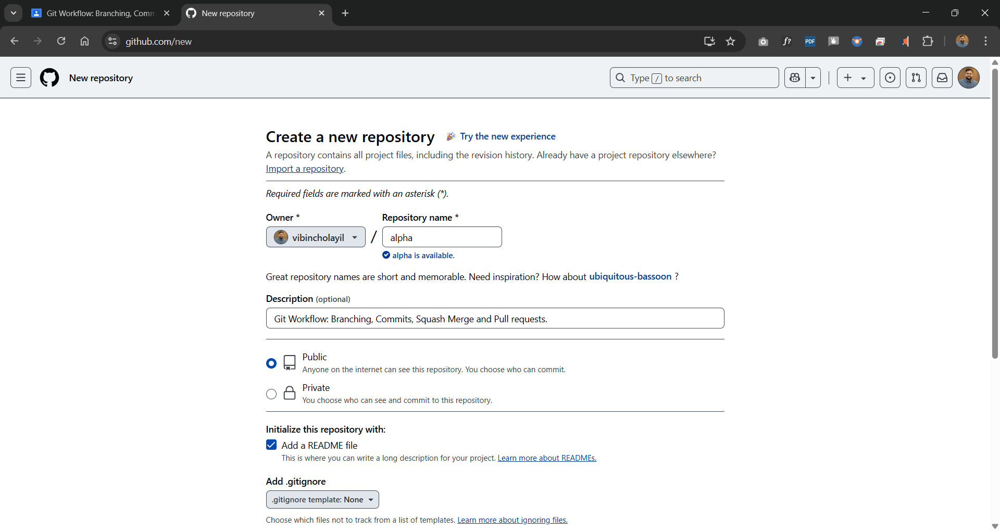  

This is my GitHub account: https://github.com/vibincholayil  

I have created a repository called **alpha** in my GitHub account.

Clone it to a local Linux VM  
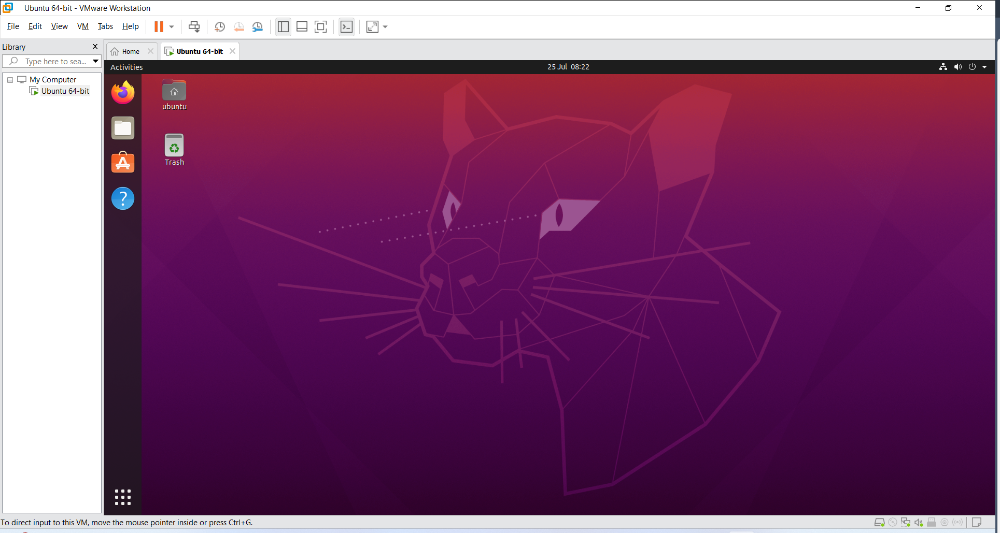  

I have already created an Ubuntu VM using VMware on my Windows machine. Just power on that machine and open the terminal inside Ubuntu to clone the repo created in GitHub.

Then open it in my VM and create a directory called `alpha` and install Git into it.

### Create few files and commit changes  
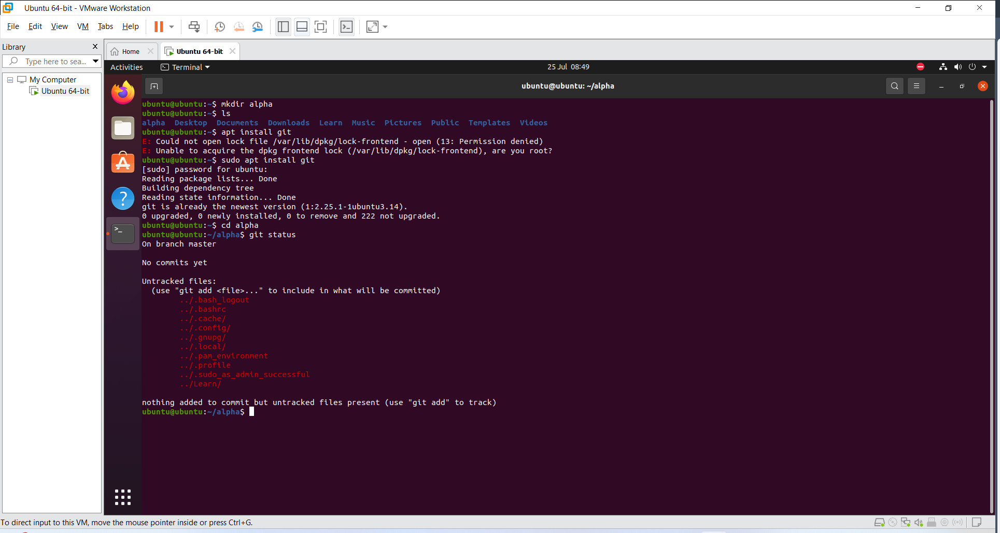  
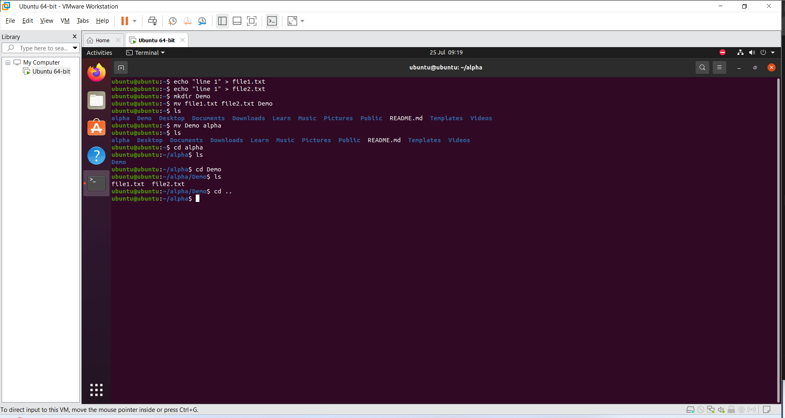  

I have moved from root to user account.

Created 1 line in 2 files and moved both to a newly created directory called `Demo`.

I have authorized Git with my Ubuntu terminal through a GitHub token.  
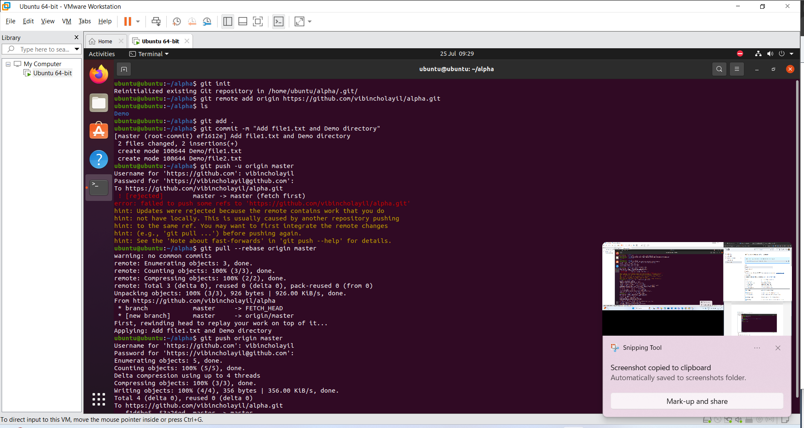  

Then added, committed, and pushed the `Demo` file to the repo.  
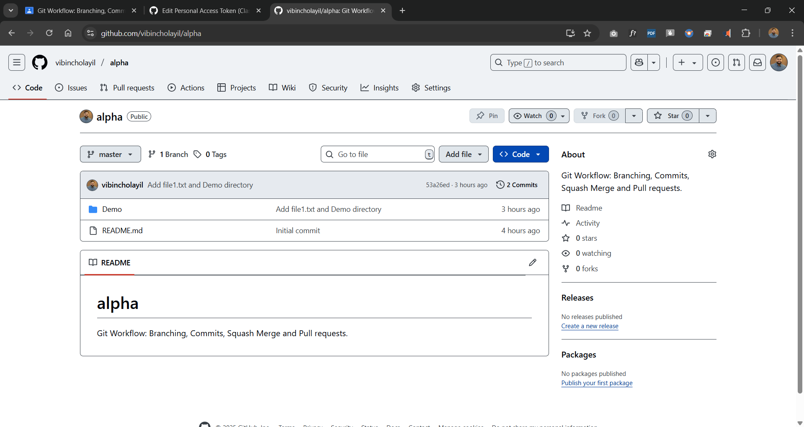  

This is how my GitHub Repo looks like now.

---

### Create a Feature branch  
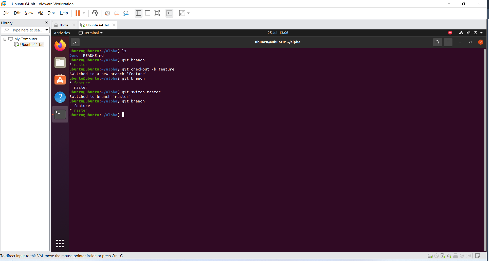  

### Make multiple changes and commits in the Feature branch  
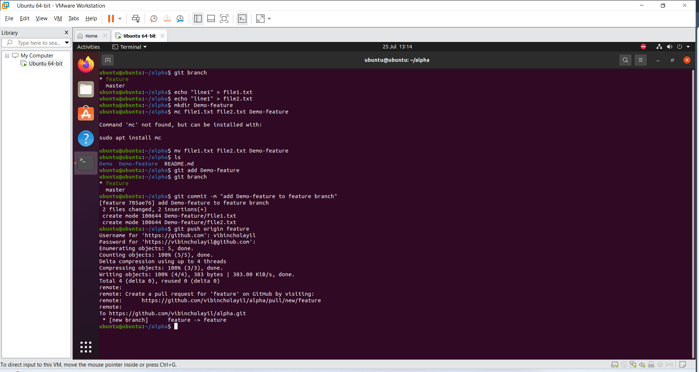  
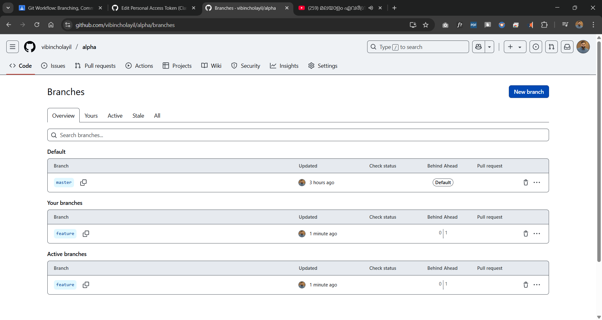  

### Git log  
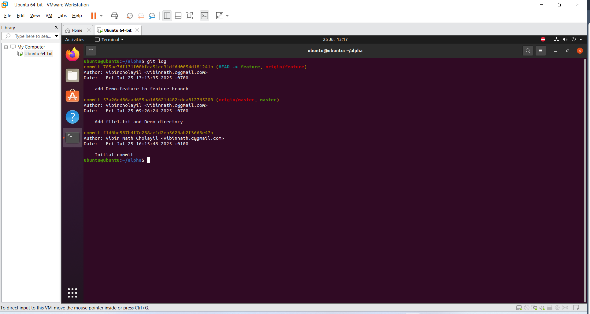  

### Squash-merge the feature branch into master  
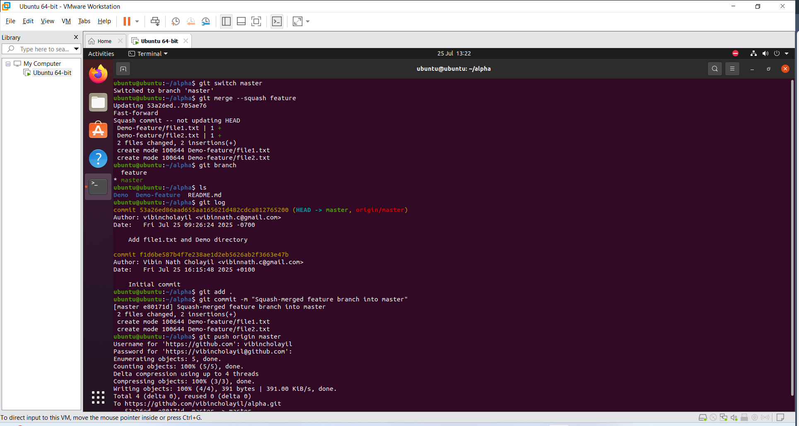  

### Show git logs after the squash merge  
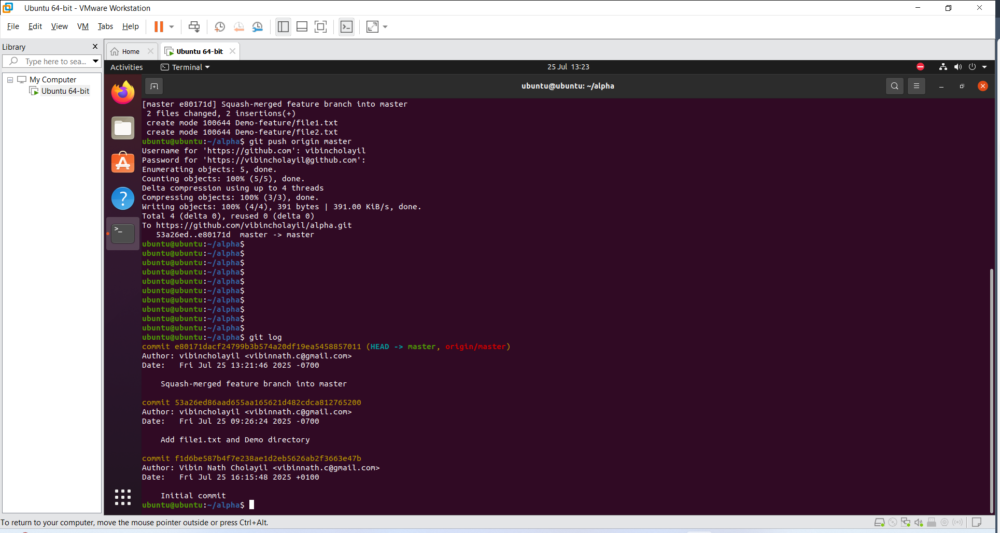  

### Push to the remote master branch in Alpha repository  

Pushed ✅

---

## Task 2  
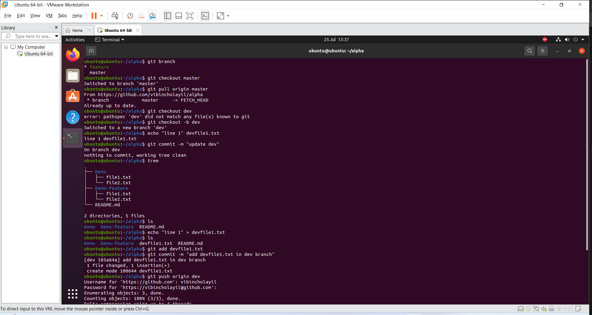  

I pulled the latest from the master branch in the Alpha repository, then created and switched to a branch named **Dev**. For making changes in the dev branch, I created one file and pushed the Dev branch to the Alpha repository.  
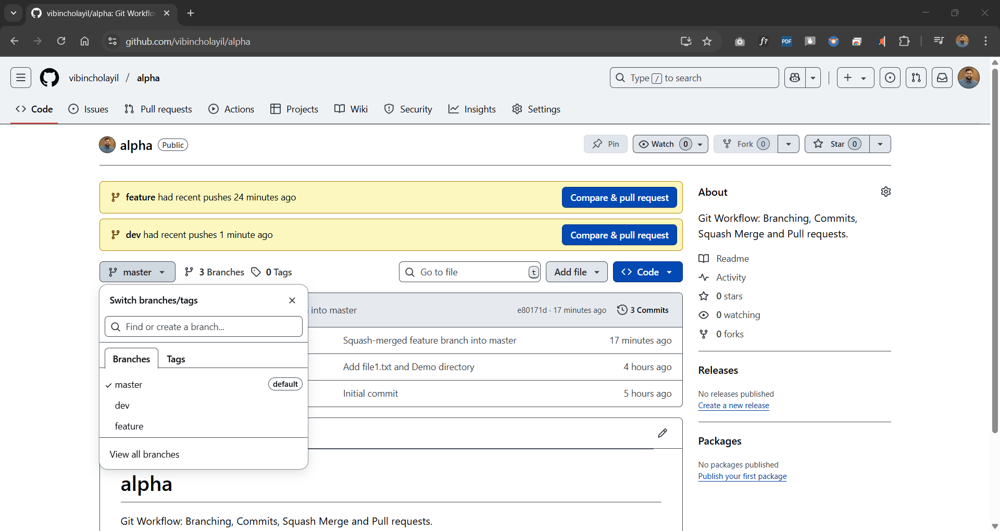  

This is how my branches and repo look like:  
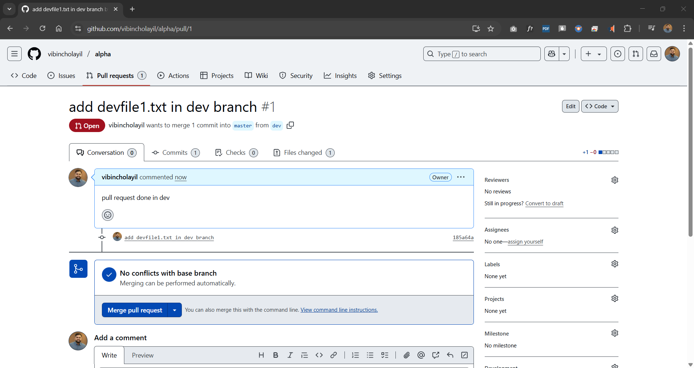  

### Raise a pull request from Dev branch to the Master branch  
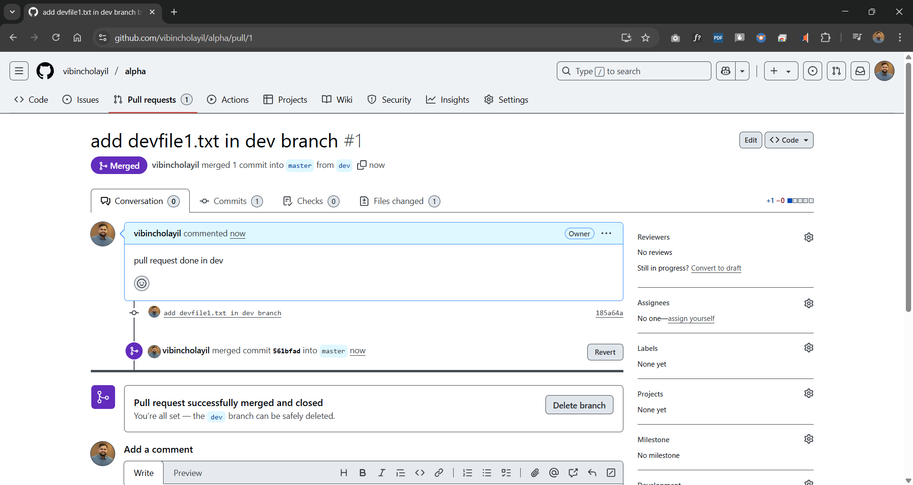  
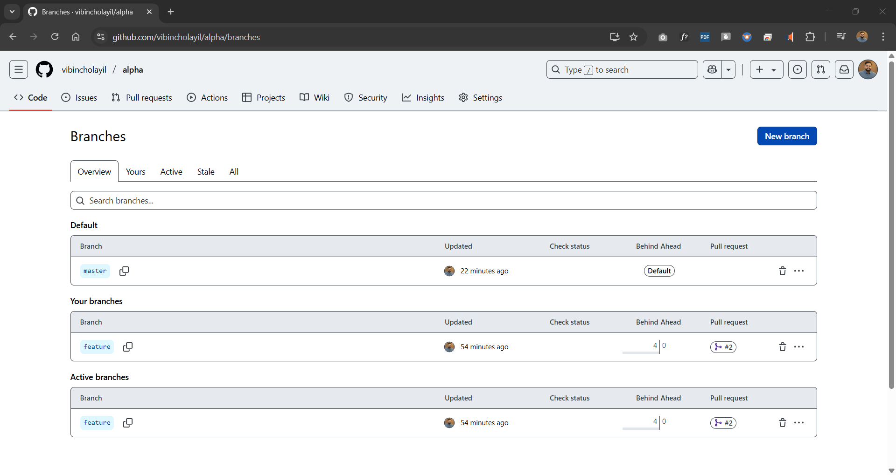  

### Complete the pull request and ensure the dev branch is deleted after the merge  
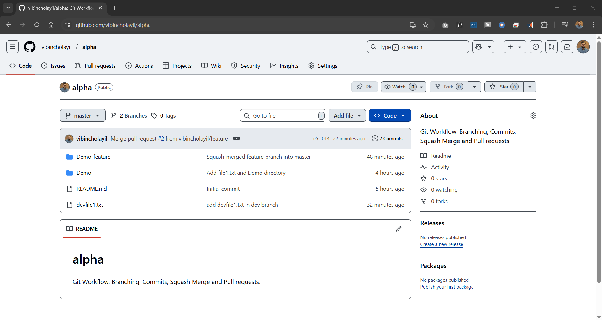  

Verified that changes have been merged into the Master branch.

---

## Conclusion

This project provided practical experience with core Git concepts and workflows. I successfully created and cloned a GitHub repository, managed files through version control, and practiced effective branching strategies using feature and dev branches. By making multiple commits and using squash merging, I maintained a clean and meaningful commit history.

Additionally, I pushed changes to the remote repository, raised and completed a pull request, and verified the merge process. Throughout the task, I reinforced my understanding of how to collaborate in a structured Git environment, which is essential for modern software development and DevOps practices.

---

**Thank you**
